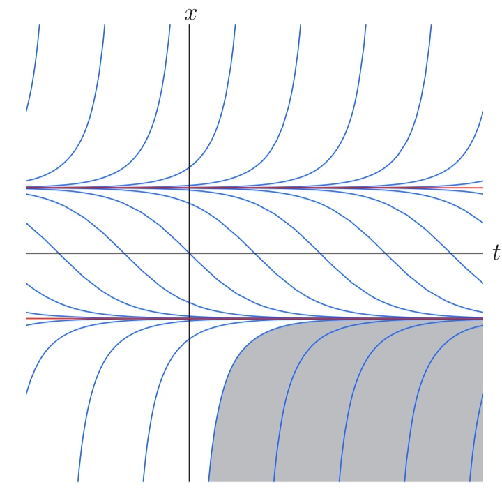
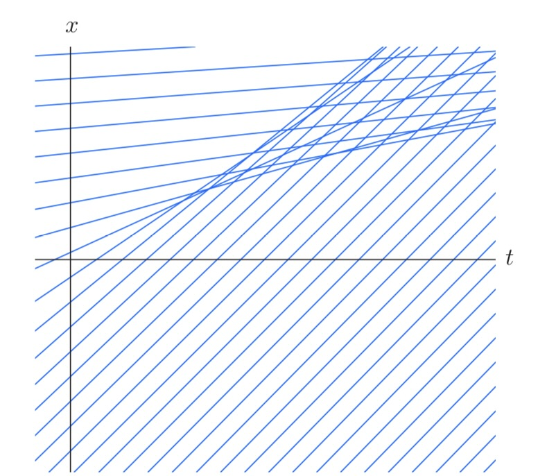
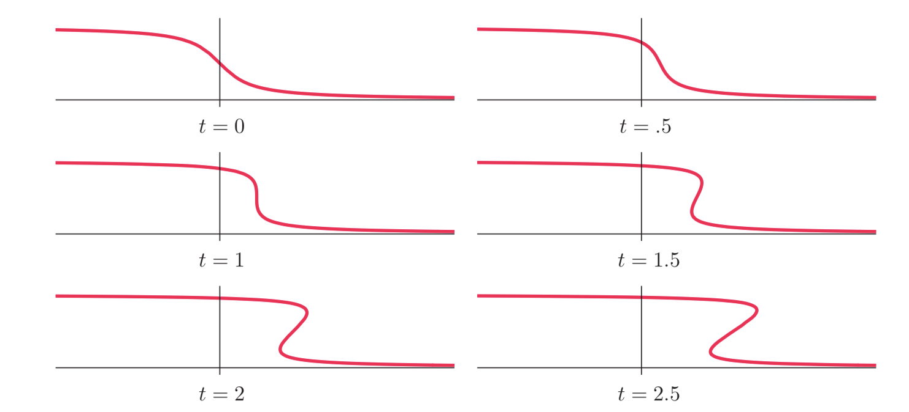

# Motivation: Uniform transport

The transport equation models the movement of an object by: 

$$
\frac{\partial u}{\partial t} + c \frac{\partial u}{\partial x} = 0
$$

where $c$ is a fixed constant. It turns out that we can reduce this equation by transforming the coordinate system: instead of viewing $x$ as the position of a fixed object, we can use 
$$
\xi = x - ct
$$
as the position of the object relative to an observer moving at speed $c$. (train leaving station, etc.)  

Writing $u(t,x) = v(t,\xi)$, we have by the chain rule:
$$
\frac{\partial u}{\partial t} + c \frac{\partial v}{\partial x} = \frac{\partial v}{\partial t} - c \frac{\partial v}{\partial \xi} + c \frac{\partial v}{\partial \xi} = 0
$$

leaving us with the equation $\frac{\partial v}{\partial t} = 0$, which is easily solved by $v(\xi,t) = f(\xi)$, where $f \in C^1$. 

Now the solution is given by:
$$
u(t, x) = f(x - ct)
$$

Note that at time zero, $u(0, x)=f(x)$, so we can have a (unique) solution to the initial value problem when $f$ is specified.  

Also note that the solution $u(t, x)=c$ is constant when $x=ct+k$, this is called a **characteristic curve**, which is considered in more detail in the next section.  

## Transport with decay

Now consider the slightly different equation:  
$$
\frac{\partial u}{\partial t} + c \frac{\partial u}{\partial x} +a u = 0
$$
where $a$ is a constant.

Using the same techniques and solving a linear ODE, we find that the solution is given by:  
$$
u(t,x) = f(x-ct) e^{-at}
$$

# Non-uniform transport  

When we replace $c$ with a function $c(x)$, we recall that in the uniform case the characteristic curve is identified with $h(t) = u(t, x(t))$ with $x(t)=ct+k$.  (parametrised by $t$)

On this curve, we have 
$$\frac{dh}{dt} = \frac{\partial u}{\partial t} + c \frac{\partial u}{\partial x} = 0
$$ 
($h$ is constant on the curve)

Following the same idea, we can consider the curve $x(t)$ such that $h(t) = u(t, x(t))$ is constant.  Then we set:  

$$
\frac{dh}{dt} = \frac{\partial u}{\partial t} + \frac{\partial u}{\partial x} \frac{dx}{dt} = 0
$$

This is valid when:

$$
\frac{dx}{dt} = c(x(t))
$$

Now we can define the **characteristic curve** as the curve $(t, x(t))$ which satisfies the ODE above.  

In other words, the slope of the characteristic curve is given by the function $c(x)$, if $c$ is constant, then we are back to the uniform case.  

To solve the equation, recall $h(t)=u(t, x(t))$ is constant on the characteristic curve, so it must be a function of the **characteristic variable** 
$$
\xi(t) = \beta(x) - t
$$

where $\beta(x) = \int \frac{dx}{c(x)} = t+k$ is obtained by solving the ODE above. (the curve is thus $x(t)=\beta^{-1}(t+k)$)

Thus, 

$$
u(t,x) = f(\beta(x) - t)
$$

where $f\in C^1$ is arbitrary.  

**Example:**  

Consider the equation: 

$$
u_t +(x^2 - 1)u_x = 0
$$  

In this case, the characteristic curve is given by the solutions to the ODE:  
$$
\frac{dx}{dt} = x^2 - 1
$$  

which gives $\beta(x) = \frac{1}{2} \log \left| \frac{x-1}{x+1} \right| = t + k$, more explicitly the curve is given by:  
$$
\left(t, \frac{1+\exp(2(t+k))}{1-\exp(2(t+k))} \right)
$$  

which can only touch the $x-axis$ (we are working with $x$ and $t$ frame) when $k\geq 0$ and admits two horizontal asymptotes $x=1$ and $x=-1$. 

<!-- Include a plot here -->
{#id .class width=50% height=50%}

# Nonlinear Transport and Shocks  

Consider the simple nonlinear transport equation, also known as the (inviscid) **Burgers' equation**: (used to model traffic flow, etc.)

$$
\frac{\partial u}{\partial t} + u\frac{\partial u}{\partial x} = 0
$$

here the speed depends on the magnitude of the wave.  

We follow the same method of characteristics, and obtain the ODE:
$$
\frac{dx}{dt} = u(t, x(t))
$$

<!-- Note since the solution is constant on the characteristic curve, we have:
$$
\frac{dx}{dt}=u
$$

where $u$ is any -->

Thus, a **characteristic curve** is given by a *straight line* 

$$
x(t) = ut + k
$$

where $k$ is a constant.

Now the solution is *implicitly* given by:
$$
u(t, x) = f(x-ut)
$$  
  
where $f$ is arbitrary in $C^1$.

While we can approach the initial value problem by setting $u(0,x)=f(x)$, it is more intuitive to consider through each point $(0,y)$, 

$$
x = tf(y) + y
$$  

with slope $u(0,y)=f(y)$ (since the value along the characteristic curve is specified by the initial function) and we check 
$$
u(t, tf(y) + y) = f(y)
$$
for all $t$, which ensures the solution will have the same value as the initial function along the characteristic curve.  

**Example:**  

If initially $f(y) = y$, then $u(t,x)=u(t, ty+y) = y$ for all $t$, so $u(t,x)=\frac{x}{t+1}$ is the solution.  

## Types of Characteristic Lines  

Recall that characteristic lines determine the solution to the PDE. In the ideal case, we have a unique solution along each characteristic line. However, this is not always true.  

**Parallel characteristic lines**: in this case, the solution is constant along each characteristic line and we have uniqueness.  

**Diverging characteristic lines**: This situation induces a wave called the **rarefaction wave**. We have the derivative of initial $f'(x)\geq 0$ for all $x$, so the characteristic lines are diverging. (do not intersect for $t>0$)

**Intersecting characteristic lines**: This situation induces a wave called **compression wave** at first and then deviates away from the classical solution (shock is produced). We have the derivative of initial $f'(x)<0$ for some $x$, so the characteristic lines are converging. (intersect for $t>0$)

{#id .class width=50% height=50%}  

An important observation is that the characteristic line intersects when the solution wave steepens to be vertical from a compression, which occurs when the derivative 

$$
\frac{\partial u}{\partial x}(t,x_\star) \to \infty \qquad \mathrm{as} \qquad t\to t_\star
$$

where $x_\star$ is the point where the characteristic lines intersect and $t_\star$ is the time when the characteristic lines intersect.

{#id .class width=50% height=50%}

To derive this, we consider the intersection of characteristic lines, take an arbitrary $y$:  

$$
tf(y)+y = tf(y + \Delta y) + y + \Delta y
$$

which gives $t = -\frac{\Delta y}{f(y+\Delta y) - f(y)}$, taking the limit as $\Delta y \to 0$, we obtain the result $t_\star = -\frac{1}{f'(y)}$. 

So as soon as we can have a negative derivative for some $y$, we will be in trouble, thus the critical time is  

$$
t_\star = \min \{ -\frac{1}{f'(y)} \mid f'(y)<0 \}
$$

Alternatively, we can derive the critical time by differentiating the solution
$$
\frac{\partial u}{\partial x} =  \frac{\partial f}{\partial x} (x-ut) = f'(x-ut) (1-t\frac{\partial u}{\partial x})
$$

which gives $\frac{\partial u}{\partial x} = \frac{f'(x-ut)}{1+f'(x-ut)t}$, so the critical time is given by $1+f'(x-ut)t=0$, which gives $t_\star = -\frac{1}{f'(x-ut)}$.  

## Shock Dynamics   

When the solution produces a discontinuity, the solution graph on the $u, x$ becomes vertical and evovles into something that is not a classical function.  

Thus, we need to transform this into a solution according to *some law* by specifying its behaviour after this transformation. We will modify the multi-valued solution by introducing a **shock**, which is a discontinuity in the solution.

Since we are modelling physical phenomena, it is natural to consider various conservation laws.  

A **conservation law** in one space dimension is an equation:  

$$
\frac{\partial T}{\partial t} + \frac{\partial X}{\partial x} = 0
$$  

where $T$ is the *conserved density* and $X$ is the *flux*. Note those are functions $T(t,x,u)$ and $X(t,x,u)$.   

An integrated form of the conservation law is given by:  

$$
\frac{d}{dt} \int_a^b T(t,x,u) dx = X(t,b,u) - X(t,a,u)
$$  

where we take $x\in [a,b]$. This says that the rate of change of the total mass is equal to the flux at the boundary.   

To apply this, we can consider first a heuristic argument: the total area under curve remains unchanged when we modify the solution by introducing a shock.  

**Example:**  Consider the inviscid Burgers' equation with initial condition:
$$
u(0,x) = \begin{cases}
a & x<0 \\
b & x>0
\end{cases}
$$

where $a>b$, then we can take the mid-point between $a$ and $b$ as the shock value $s=\frac{a+b}{2}$, and we have the solution:

$$
u(t,x) = \begin{cases}
a & x<\frac{a+b}{2}t \\
b & x>\frac{a+b}{2}t
\end{cases}
$$

which is a shock wave moving at speed $\frac{a+b}{2}$.  In the case where $a<b$, we can connect the two values at the endpoints to get
$$
u(t,x) = \begin{cases}
a & x<at \\
b & x>bt \\
x/t & at<x<bt
\end{cases}
$$

Moving to a more mathematical argument, we have the **Rankine-Hugoniot condition** which governs the shock dynamics uniquely.  

**Rankine-Hugoniot condition**:  Let $u(t,x)$ be a solution to the nonlinear transport equation (Burger's equation) with discontinuity at $x=\sigma(t)$ with finite, unequal left and right limits  

$$
u^-(t) = \lim_{x\to \sigma(t)^-} u(t,x) \qquad u^+(t) = \lim_{x\to \sigma(t)^+} u(t,x)
$$

Then the conversation of mass deterimes the speed of the shock:  
$$
\frac{d\sigma}{dt} = \frac{u^-(t) + u^+(t)}{2}
$$

The proof simply follows from the conservation law. We approximate the mass $M(t)=\int_a^b u(t,x) dx$ by $u^+(t)(b-a)$ with $\sigma(t)=a, \sigma(t+\Delta t)=b$. Then we have:
$$
\frac{dM}{dt} = \lim_{\Delta t \to 0} [u^-(t+\Delta t)-u^+(t)] \frac{\sigma(t+\Delta t) - \sigma(t)}{\Delta t} = \frac{d\sigma}{dt} (u^-(t)-u^+(t))
$$

Now the flux is given by $\frac{1}{2}[u(\tau, a)^2 - u(\tau, b)^2] \to \frac{1}{2}[u^-(t)^2 - u^+(t)^2]$ as $\tau \to t$, so setting $\frac{dM}{dt} = \frac{1}{2}[u^-(t)^2 - u^+(t)^2]$, we obtain the result.

Another governing condition is the **Entropy condition**:
$$
u^-(t) > \frac{d \sigma}{dt} = \frac{u^-(t) + u^+(t)}{2} > u^+(t)
$$

which gives the bound for shock speed (note this can be applied to our example above).

**Example:** Now consider the triangular wave initial condition 
$$
u(0,x) = \begin{cases}
x & x\in [0,1]  \\
0 & \mathrm{otherwise}
\end{cases}
$$

Then we have $u(t, tf(y)+y) = y$ for $y\in [0,1]$ and $u(t, tf(y)+y) = u(t, y)=0$ otherwise. This translates to $u(t,x)=\frac{x}{t+1}$ for $x\in [0,t+1]$ and $u(t,x)=0$ for $\{x\leq 0\} \cup \{x\geq 1\}$, hence a multivalued function appears. 

Using the Rankine-Hugoniot condition, we have $u^-(t)=u(t, \sigma(t)^-) = \frac{\sigma(t)}{t+1}$ and $u^+(t)=u(t, \sigma(t)^+) = 0$, so the speed of the shock is given by $\frac{d\sigma}{dt} = \frac{1}{2} \frac{\sigma(t)}{t+1}$, which gives $\sigma(t) = \sqrt{t+1}$, so the solution is given by:
$$
u(t,x) = \begin{cases}
\frac{x}{t+1} & x\in [0,\sqrt{t+1}]  \\
0 & \mathrm{otherwise}
\end{cases}
$$

In fact, the existence and uniqueness of a solution is guaranteed by the Rankine-Hugoniot condition and the entropy condition.  

**Theorem:** The existence and uniqueness of a (weak) solution to the nonlinear transport equation is guaranteed by the Rankine-Hugoniot condition and the entropy condition if the initial data is:
- $u(0,x)=f(x), \qquad f\in C^1$

- $f$ has finitely many jump discontinuities

## Extensions to general wave speeds  

We can extend the discussions above to the more general version of nonlinear transport equation:
$$
u_t + c(u) u_x = 0
$$

where $c(u)$ is a function of $u$.

Now to obtain the characteristic curves, we solve:
$$
\frac{dx}{dt} = c(u(t,x))
$$

So the characteristic curves are given by the solutions to the ODE above as: $t c(u) + k = x$, which gives $u(t,x) = f(x-tc(u))$ for some $f\in C^1$.  

Now combining with initial condition $u(0,x)=f(x)$, we have $u(t,tc(f(y))+y) = f(y)$.  

The Rankine-Hugoniot condition becomes:
$$
\frac{d\sigma}{dt} = \frac{C(u^-(t)) + C(u^+(t))}{u^-(t) - u^+(t)}
$$

where $C(u) = \int c(u) du$ an antiderivative of $c(u)$.  

